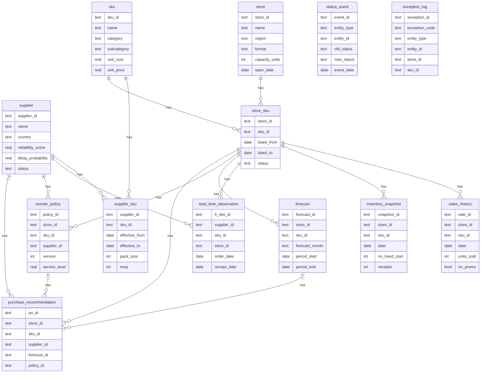

# Entity-relationship diagram

```mermaid
erDiagram
  supplier ||--o{ supplier_sku : has
  sku ||--o{ supplier_sku : has
  store ||--o{ store_sku : has
  sku ||--o{ store_sku : has
  store_sku ||--o{ sales_history : has
  store_sku ||--o{ inventory_snapshot : has
  supplier ||--o{ lead_time_observation : has
  store_sku ||--o{ lead_time_observation : has
  store_sku ||--o{ forecast : has
  store_sku ||--o{ reorder_policy : has
  supplier ||--o{ reorder_policy : has
  forecast |o--o{ purchase_recommendation : has
  reorder_policy |o--o{ purchase_recommendation : has
  supplier |o--o{ purchase_recommendation : has
  store_sku ||--o{ purchase_recommendation : has
  supplier {
    text supplier_id
    text name
    text country
    real reliability_score
    real delay_probability
    text status
  }
  store {
    text store_id
    text name
    text region
    text format
    int capacity_units
    date open_date
  }
  sku {
    text sku_id
    text name
    text category
    text subcategory
    real unit_cost
    real unit_price
  }
  supplier_sku {
    text supplier_id
    text sku_id
    date effective_from
    date effective_to
    int pack_size
    int moq
  }
  store_sku {
    text store_id
    text sku_id
    date listed_from
    date listed_to
    text status
  }
  sales_history {
    text sale_id
    text store_id
    text sku_id
    date date
    int units_sold
    bool on_promo
  }
  inventory_snapshot {
    text snapshot_id
    text store_id
    text sku_id
    date date
    int on_hand_start
    int receipts
  }
  lead_time_observation {
    text lt_obs_id
    text supplier_id
    text sku_id
    text store_id
    date order_date
    date receipt_date
  }
  status_event {
    text event_id
    text entity_type
    text entity_id
    text old_status
    text new_status
    date event_date
  }
  forecast {
    text forecast_id
    text store_id
    text sku_id
    text forecast_month
    date period_start
    date period_end
  }
  reorder_policy {
    text policy_id
    text store_id
    text sku_id
    text supplier_id
    int version
    real service_level
  }
  purchase_recommendation {
    text po_id
    text store_id
    text sku_id
    text supplier_id
    text forecast_id
    text policy_id
  }
  exception_log {
    text exception_id
    text exception_code
    text entity_type
    text entity_id
    text store_id
    text sku_id
  }
```
